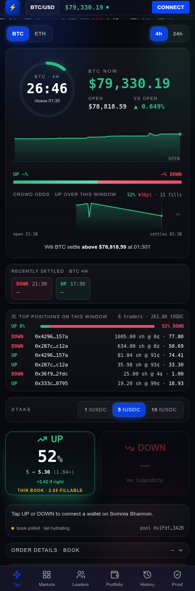
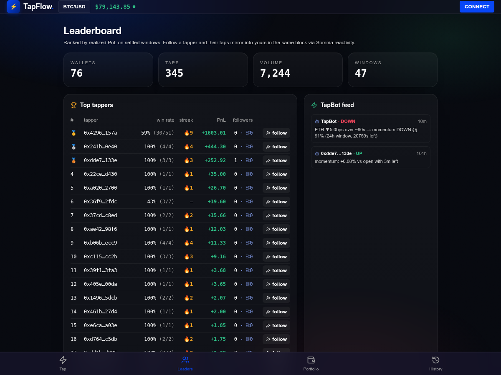
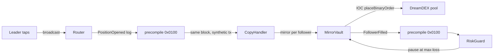
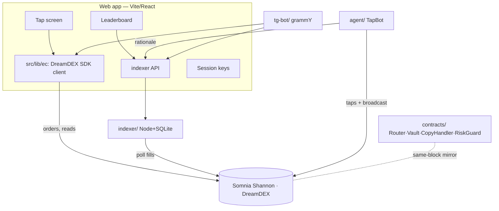

# TapFlow ⚡

**One tap on the next five minutes. Follow the best tappers. Their taps mirror into yours in the same block.**

TapFlow turns every live DreamDEX Event Contract into a one-tap UP/DOWN game, lets you copy the top tappers block-for-block through Somnia on-chain reactivity, and never shows a wallet popup after login. Built for the Somnia × DreamDEX Event Contracts hackathon.

<p align="center">
  
  
</p>

- **Live app:** https://tapflow-phi.vercel.app
- **Same-block mirror, on the explorer:** [block 482312219](https://shannon-explorer.somnia.network/block/482312219) — leader broadcast and follower's reactive order, one block.
- **Telegram bot:** `<t.me/your_bot>` · **Demo video:** `<link>`
- Every number in the app is read live from Somnia Shannon. Nothing in the demo path is mocked.

---

## The problem → the product

Prediction markets are solo and clunky: connect, approve, read an order book, sign every order, wait. TapFlow compresses that to a tap. A window is a binary market — *will BTC be up at the end of this 5-minute window?* You see the countdown, the price against where it opened, and the crowd's odds. You tap UP or DOWN. Your stake is a real immediate-or-cancel order on the on-chain book. Winning shares pay 1 tUSDC. When it settles, you claim, share, and tap again — and the best tappers become leaders anyone can copy.

## What's built (F1–F7)

| # | Feature | State | Proof |
|---|---|---|---|
| **F1** | Tap screen on real Event Contracts | ✅ live | places IOC orders, live book/odds/spot, claims, on-chain fills history |
| **F2** | One-tap session keys | ✅ live | capped auto-sweeping session wallet: one funding popup, then zero prompts |
| **F3** | Copy-trading contracts (reactivity) | ✅ **deployed + proven on Shannon** | same-block mirror in [block 482312219](https://shannon-explorer.somnia.network/block/482312219); subscription `16760441`; `forge test` 10/10 |
| **F4** | Fills indexer + leaderboard API | ✅ live | 47 wallets / 177 taps / 3.6k tUSDC indexed from chain |
| **F5** | TapBot momentum agent | ✅ built, configured with the leader key | live signal + window-odds read verified; broadcasts through the deployed Router |
| **F6** | Telegram bot + mini-app | ✅ built | `tsc` clean, live `/window` odds path verified |
| **F7** | README + SDK feedback | ✅ this file + `SDK-FEEDBACK.md` | — |

Everything above runs against real Shannon transactions from wallet `0x6798…F228` (leader) and `0x1AD9…2015` (follower). Only the RiskGuard subscription is still pending: it needs another 32 STT, which is one more faucet claim away.

## DreamDEX integration

Everything runs on `@somnia-chain/markets-sdk` ^0.28.1 against the DreamDEX venue on Shannon.

| Touchpoint | Where | Purpose |
|---|---|---|
| `client.listLiveBinaryMarkets({ venueId })` | `src/lib/ec/markets.ts` | discover live windows on the venue |
| `client.getMarketOnchain(marketId)` | markets.ts, useSettlement | gate on on-chain status; resolve win/loss |
| `client.getBinaryOrderBook(pool)` + `quoteBinaryStakeOverBook` | `src/lib/ec/tap.ts` | size a stake over the YES/NO book |
| `trader.placeOrder({ orderType: MARKET })` | tap.ts | the tap — an IOC buy |
| `trader.faucet()` | Header, tap flow | mint testnet tUSDC |
| `client.getOutcomeBalance` / `getClaimable` / `trader.redeem` | positions.ts, Portfolio | positions + claim winnings |
| `client.getUserFills` / `getFills` | HistoryView, indexer | on-chain fills for history + leaderboard |
| `ex.fetchPrice(asset)` / `useLivePriceTicks` | price tape, agent | oracle spot for the tape and momentum |
| `trader.setOperatorApprovalForPool` / `setManualVaultMode` / `depositVault` | `src/lib/ec/operator.ts` | non-custodial session-key upgrade (researched) |

REST `https://stg.api.dreamdex.io/v0` · indexer `https://dev.smk.somnia.host/v1/graphql` · Shannon RPC `https://dream-rpc.somnia.network` · chain 50312 · venue `0x679795a0…5e8a28c`.

### Real transactions (Shannon, 7 Sep 2026)

| Step | Tx |
|---|---|
| Mint tUSDC from the on-chain faucet (`trader.faucet()`) | [`0x5001c2…d9558`](https://shannon-explorer.somnia.network/tx/0x5001c2118f58b96c4ecc2126efc54837172e2deadee0be24bdf97444940d9558) |
| First real tap — ETH 24h UP, 6.62 shares @ 14% for 0.93 tUSDC (IOC `placeOrder`) | [`0x347e32…7bcf4`](https://shannon-explorer.somnia.network/tx/0x347e3202778dcd1856d1f97c88b73415d2cefb28742e34c85f841587a207bcf4) |
| Leader tap in the mirror demo — 8.26 shares @ 12% | [`0xbc6c23…f4bf8`](https://shannon-explorer.somnia.network/tx/0xbc6c234c81b107d5c4e3a8ce6d21225cee76ff64df7484582c55e19ae8df4bf8) |
| Leader broadcast via `Router.broadcast` (block 482312219) | [`0x79a80a…19221`](https://shannon-explorer.somnia.network/tx/0x79a80acbe4136517ee34e695910a00e72f2f1cef7d52ad6572de2e3d6f919221) |
| **Reactive follower mirror, same block 482312219** — `MirrorVault` placed 8.26 shares for the follower, cost 0.99 | [`0xa8c248…9c4eb`](https://shannon-explorer.somnia.network/tx/0xa8c248f8b693206b0bfd24296b5a7012027df625a9f8d893bbb5ce41fe39c4eb) |
| Follower deposit into `MirrorVault` (20 tUSDC) | [`0x398723…87362`](https://shannon-explorer.somnia.network/tx/0x398723f32e1239272f6f67f39040ac6f8a587427f3ef33a595eb0bbc22c87362) |
| Follower `setFollow(leader, 1×, maxLoss 20)` | [`0xa4b76a…1ae25`](https://shannon-explorer.somnia.network/tx/0xa4b76a9e3d0af6a03e379ecc4c012bcc5fb350b6c0197dc4fa7b64391b71ae25) |
| `CopyHandler.subscribe` → reactivity subscription **16760441** | [`0xefe548…6590f`](https://shannon-explorer.somnia.network/tx/0xefe54896def9cc47815053b93bab2d0a83d37a26c6b65229893309ae9b36590f) |

Reproduce the mirror yourself: `npx tsx scripts/mirror-demo.ts ETH 24h UP 1` (needs a funded key in `.env`). It taps, broadcasts, then reads the block for the `Mirrored` and `FollowerFilled` logs and prints the proof.

## Somnia reactivity — the same-block mirror

The headline. A leader broadcasts a tap; validators deliver that event to a handler contract as a synthetic transaction **in the same block**, and the handler places every follower's proportional order. No keeper, no relayer, no next-block lag.



- **Contracts:** `contracts/src/{Router,MirrorVault,CopyHandler,RiskGuard}.sol` — solc 0.8.30, Cancun, via-IR.
- **Tests:** `cd contracts && forge test` → 10/10, covering proportional mirroring, the max-loss spend cap, a failed order being skipped (not reverting the reactive tx), the RiskGuard pause, and the 32-STT subscribe floor.
- **Deployed on Shannon** (`contracts/deployments.json`):

  | Contract | Address |
  |---|---|
  | Router | [`0x512009743f48A924F679907ca9E206b706d499Cc`](https://shannon-explorer.somnia.network/address/0x512009743f48A924F679907ca9E206b706d499Cc) |
  | MirrorVault | [`0xF5fc089748604722ADa350599a8afBAFb0A6aB0A`](https://shannon-explorer.somnia.network/address/0xF5fc089748604722ADa350599a8afBAFb0A6aB0A) |
  | CopyHandler | [`0x63Ed0a4242FD11A9A9296F8D8bDCd39D2E90c9c1`](https://shannon-explorer.somnia.network/address/0x63Ed0a4242FD11A9A9296F8D8bDCd39D2E90c9c1) — subscription **16760441** on `Router.PositionOpened`, funded with 33 STT |
  | RiskGuard | [`0xF6f6Bf736b19C7317573f282E7aE3387cb346588`](https://shannon-explorer.somnia.network/address/0xF6f6Bf736b19C7317573f282E7aE3387cb346588) — deployed + wired; subscription pending the next 32 STT faucet claim |

- **Proof:** [block 482312219](https://shannon-explorer.somnia.network/block/482312219) holds the leader's broadcast and the follower's mirrored order. The mirror is a synthetic transaction from the precompile ([`0xa8c248…`](https://shannon-explorer.somnia.network/tx/0xa8c248f8b693206b0bfd24296b5a7012027df625a9f8d893bbb5ce41fe39c4eb)); no EOA sent it.
- **Custody:** followers pre-fund `MirrorVault` and set their own ratio + max-loss; the vault can only place orders up to each follower's cap and never withdraw to anyone else.
- **Deploying on Somnia:** `forge script` cannot run `subscribe` locally (the precompile has no bytecode in Foundry's EVM), and Somnia prices contract creation ~10× Foundry's estimate. So: `forge create --gas-limit 20000000` per contract, `cast send` for wiring, funding, and `subscribe`. See `contracts/README.md`.

## Live stats

Served by the indexer (`GET /api/stats`, `/api/leaderboard`), read from chain with no key. Observed on 3 Sep 2026:

| wallets | taps indexed | volume (tUSDC) | windows |
|---|---|---|---|
| 47 | 177 | 3,647 | 42 |

## Architecture



Repo layout: `src/` web app · `contracts/` Foundry copy-trading stack · `indexer/` fills→SQLite→API · `agent/` TapBot · `tg-bot/` Telegram · `scripts/` CLI taps · `refs/` reference repos (gitignored).

## Run it

```bash
# web app
npm install && npm run dev            # http://localhost:5174

# indexer (read-only, no key) — powers the leaderboard
cd indexer && npm install && npm start    # http://localhost:8787

# agent (read-only signal; set AGENT_PRIVATE_KEY to trade)
cd agent && npm install && npm run signal

# contracts
cd contracts && npm install && forge test

# telegram bot (needs BOT_TOKEN)
cd tg-bot && npm install && npm start

# one real tap from the CLI (needs a funded key in .env)
npx tsx scripts/tap.ts faucet
npx tsx scripts/tap.ts BTC 5m UP 1
```

## Status: honest scope

- **Done & live on Shannon:** tap → real IOC order, session keys, faucet, claims, on-chain history, indexer + leaderboard + stats + OG cards, the four copy-trading contracts, the CopyHandler reactivity subscription, and a verified same-block mirror. Telegram bot built; agent built and configured.
- **Pending:** RiskGuard subscription (needs 32 more STT; the faucet gives 50 per day), a longer TapBot live run to fill the feed, the demo video.
- **Researched, not shipped:** non-custodial operator session keys (`src/lib/ec/operator.ts`).
- **Not in scope:** mainnet, cross-chain, a hosted multi-tenant relayer.

## After the hackathon

- **Mainnet (chain 5031):** the builder-fee hook is a revenue line — `builder` + `builderFeeBpsTimes1k` on `placeOrder` (testnet cap is 0; mainnet pools report a 1% cap).
- **Non-custodial copy:** move followers from the MirrorVault float to operator-key grants (`operator.ts`) so no float is ever custodied.
- **More leaders, more agents:** open the agent framework so anyone can list a strategy as a public leader.

## Credits

- **DreamDEX bot kit** — `ec-core` guards/constants and `assertTxOk` patterns (MIT).
- **ec-dreamdex-hackathon-template** — lifecycle, encodings, binary pool ABI.
- **TAPL frontend** (tapl-chainlink, 1st place Chainlink Convergence) — the base UI shell.
- **Strike** (ayazabbas) — Telegram command-flow shape.
- **@somnia-chain/reactivity-contracts** — `SomniaEventHandler` (MIT, Somnia Foundation).

See [`SDK-FEEDBACK.md`](./SDK-FEEDBACK.md) for a feedback report on the SDK and docs.
