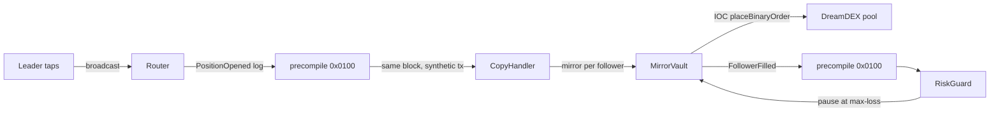
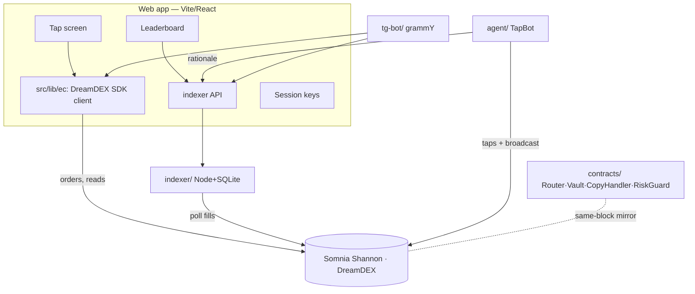

# TapFlow ⚡

**One tap on the next five minutes. Follow the best tappers. Their taps mirror into yours in the same block.**

TapFlow turns every live DreamDEX Event Contract into a one-tap UP/DOWN game, lets you copy the top tappers block-for-block through Somnia on-chain reactivity, and never shows a wallet popup after login. Built for the Somnia × DreamDEX Event Contracts hackathon.

<p align="center">
  
  
</p>

- **Live app:** `<vercel-url>` (deploy: `vercel --prod`)
- **Telegram bot:** `<t.me/your_bot>` · **Demo video:** `<link>`
- Every number in the app is read live from Somnia Shannon. Nothing in the demo path is mocked.

---

## The problem → the product

Prediction markets are solo and clunky: connect, approve, read an order book, sign every order, wait. TapFlow compresses that to a tap. A window is a binary market — *will BTC be up at the end of this 5-minute window?* You see the countdown, the price against where it opened, and the crowd's odds. You tap UP or DOWN. Your stake is a real immediate-or-cancel order on the on-chain book. Winning shares pay 1 tUSDC. When it settles, you claim, share, and tap again — and the best tappers become leaders anyone can copy.

## What's built (F1–F7)

| # | Feature | State | Proof |
|---|---|---|---|
| **F1** | Tap screen on real Event Contracts | ✅ live | places IOC orders, live book/odds/spot, claims, on-chain fills history |
| **F2** | One-tap session keys | ✅ live | capped auto-sweeping session wallet: one funding popup, then zero prompts |
| **F3** | Copy-trading contracts (reactivity) | ✅ built + tested, ⏳ deploy needs key | `forge test` 10/10 green; deploy+subscribe script verified in simulation |
| **F4** | Fills indexer + leaderboard API | ✅ live | 47 wallets / 177 taps / 3.6k tUSDC indexed from chain |
| **F5** | TapBot momentum agent | ✅ built, ⏳ trading needs key | live signal + window-odds read verified read-only |
| **F6** | Telegram bot + mini-app | ✅ built | `tsc` clean, live `/window` odds path verified |
| **F7** | README + SDK feedback | ✅ this file + `SDK-FEEDBACK.md` | — |

The three ⏳ items are code-complete and verified as far as is possible without a funded key; each is one funded Shannon wallet away from live. See **What's blocked on a funded key** below.

## DreamDEX integration

Everything runs on `@somnia-chain/markets-sdk` ^0.28.1 against the DreamDEX venue on Shannon.

| Touchpoint | Where | Purpose |
|---|---|---|
| `client.listLiveBinaryMarkets({ venueId })` | `src/lib/ec/markets.ts` | discover live windows on the venue |
| `client.getMarketOnchain(marketId)` | markets.ts, useSettlement | gate on on-chain status; resolve win/loss |
| `client.getBinaryOrderBook(pool)` + `quoteBinaryStakeOverBook` | `src/lib/ec/tap.ts` | size a stake over the YES/NO book |
| `trader.placeOrder({ orderType: MARKET })` | tap.ts | the tap — an IOC buy |
| `trader.faucet()` | Header, tap flow | mint testnet tUSDC |
| `client.getOutcomeBalance` / `getClaimable` / `trader.redeem` | positions.ts, Portfolio | positions + claim winnings |
| `client.getUserFills` / `getFills` | HistoryView, indexer | on-chain fills for history + leaderboard |
| `ex.fetchPrice(asset)` / `useLivePriceTicks` | price tape, agent | oracle spot for the tape and momentum |
| `trader.setOperatorApprovalForPool` / `setManualVaultMode` / `depositVault` | `src/lib/ec/operator.ts` | non-custodial session-key upgrade (researched) |

REST `https://stg.api.dreamdex.io/v0` · indexer `https://dev.smk.somnia.host/v1/graphql` · Shannon RPC `https://dream-rpc.somnia.network` · chain 50312 · venue `0x679795a0…5e8a28c`.

> **Transaction hashes** land here after the first funded run: `npx tsx scripts/tap.ts BTC 5m UP 1` prints the tap tx + explorer link; `refs/ec-dreamdex-hackathon-template` `npm run lifecycle` prints mint/order/redeem hashes.

## Somnia reactivity — the same-block mirror

The headline. A leader broadcasts a tap; validators deliver that event to a handler contract as a synthetic transaction **in the same block**, and the handler places every follower's proportional order. No keeper, no relayer, no next-block lag.



- **Contracts:** `contracts/src/{Router,MirrorVault,CopyHandler,RiskGuard}.sol` — solc 0.8.30, Cancun, via-IR.
- **Tests:** `cd contracts && forge test` → 10/10, covering proportional mirroring, the max-loss spend cap, a failed order being skipped (not reverting the reactive tx), the RiskGuard pause, and the 32-STT subscribe floor.
- **Handler addresses + subscription IDs:** written to `contracts/deployments.json` by the deploy script and surfaced here after deploy. Deploy: `FUND_HANDLERS=true forge script script/Deploy.s.sol --rpc-url shannon --broadcast`.
- **Custody:** followers pre-fund `MirrorVault` and set their own ratio + max-loss; the vault can only place orders up to each follower's cap and never withdraw to anyone else.

## Live stats

Served by the indexer (`GET /api/stats`, `/api/leaderboard`), read from chain with no key. Observed on 3 Sep 2026:

| wallets | taps indexed | volume (tUSDC) | windows |
|---|---|---|---|
| 47 | 177 | 3,647 | 42 |

## Architecture



Repo layout: `src/` web app · `contracts/` Foundry copy-trading stack · `indexer/` fills→SQLite→API · `agent/` TapBot · `tg-bot/` Telegram · `scripts/` CLI taps · `refs/` reference repos (gitignored).

## Run it

```bash
# web app
npm install && npm run dev            # http://localhost:5174

# indexer (read-only, no key) — powers the leaderboard
cd indexer && npm install && npm start    # http://localhost:8787

# agent (read-only signal; set AGENT_PRIVATE_KEY to trade)
cd agent && npm install && npm run signal

# contracts
cd contracts && npm install && forge test

# telegram bot (needs BOT_TOKEN)
cd tg-bot && npm install && npm start

# one real tap from the CLI (needs a funded key in .env)
npx tsx scripts/tap.ts faucet
npx tsx scripts/tap.ts BTC 5m UP 1
```

## What's blocked on a funded key

Everything below is code-complete and verified as far as possible without secrets:

- **First real tap + tx hashes** — needs a Shannon key with STT + tUSDC (`scripts/tap.ts`).
- **Contract deploy + subscription IDs** — needs the key **and ≥ 64 STT** (each of the two reactivity subscriptions requires its handler to hold 32 STT at subscribe time). Ask the faucet topic for 70 STT.
- **TapBot live trading** and the **in-block mirror on the explorer** — follow from the two above.

## Status: honest scope

- **Done & live:** tap → real order, session keys, faucet, claims, on-chain history, indexer + leaderboard + stats + OG cards, agent signal, Telegram bot, mobile-first UX.
- **PoC / awaiting deploy:** the reactive mirror (contracts tested, not yet on Shannon), TapBot trading, non-custodial operator session keys (researched + stubbed).
- **Not in scope:** mainnet, cross-chain, a hosted multi-tenant relayer.

## After the hackathon

- **Mainnet (chain 5031):** the builder-fee hook is a revenue line — `builder` + `builderFeeBpsTimes1k` on `placeOrder` (testnet cap is 0; mainnet pools report a 1% cap).
- **Non-custodial copy:** move followers from the MirrorVault float to operator-key grants (`operator.ts`) so no float is ever custodied.
- **More leaders, more agents:** open the agent framework so anyone can list a strategy as a public leader.

## Credits

- **DreamDEX bot kit** — `ec-core` guards/constants and `assertTxOk` patterns (MIT).
- **ec-dreamdex-hackathon-template** — lifecycle, encodings, binary pool ABI.
- **TAPL frontend** (tapl-chainlink, 1st place Chainlink Convergence) — the base UI shell.
- **Strike** (ayazabbas) — Telegram command-flow shape.
- **@somnia-chain/reactivity-contracts** — `SomniaEventHandler` (MIT, Somnia Foundation).

See [`SDK-FEEDBACK.md`](./SDK-FEEDBACK.md) for a feedback report on the SDK and docs.
