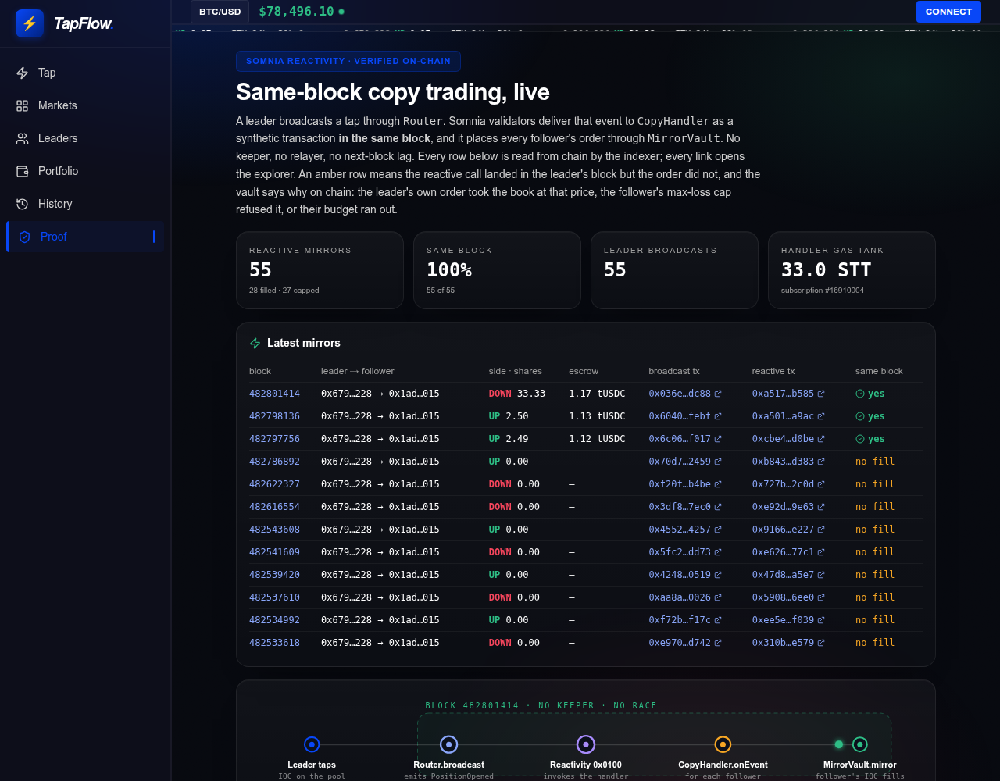
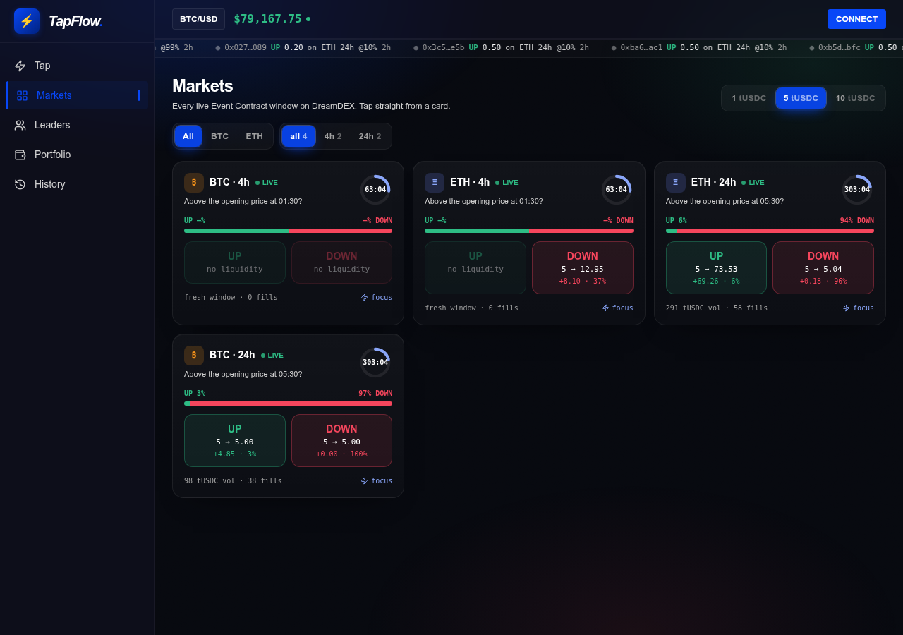
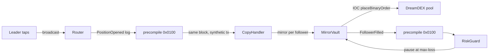
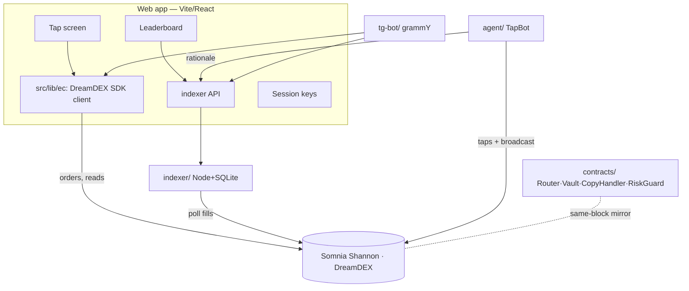

# TapFlow ⚡

[](https://github.com/Prashant-thakur77/tapflow/actions/workflows/ci.yml) [](https://tapflow-phi.vercel.app) [](https://shannon-explorer.somnia.network)

**One tap on the next five minutes. Follow the best tappers. Their taps mirror into yours in the same block.**

TapFlow turns every live DreamDEX Event Contract into a one-tap UP/DOWN game, lets you copy the top tappers block-for-block through Somnia on-chain reactivity, and never shows a wallet popup after login. Built for the Somnia × DreamDEX Event Contracts hackathon.

<p align="center">
  
  
</p>
<p align="center">
  
</p>

- **Live app:** https://tapflow-phi.vercel.app · **Indexer API:** https://tapflow-indexer.onrender.com (hosted, read-only) · **Proof page (live, from chain):** https://tapflow-phi.vercel.app/proof · **Markets grid:** https://tapflow-phi.vercel.app/markets
- **Same-block mirror, on the explorer:** [block 482312219](https://shannon-explorer.somnia.network/block/482312219) (UP) and [block 482322170](https://shannon-explorer.somnia.network/block/482322170) (DOWN) — leader broadcast and follower's reactive order, one block. The indexer has paired **8 of 8** mirrors with their broadcast in the same block, including five placed autonomously by TapBot.
- **Code:** https://github.com/Prashant-thakur77/tapflow · **Narration script:** [`docs/DEMO-SCRIPT.md`](docs/DEMO-SCRIPT.md) · **Demo video:** [`docs/media/tapflow-demo-silent.mp4`](docs/media/tapflow-demo-silent.mp4) (silent walkthrough; narrated cut linked on DoraHacks) · **Telegram bot:** [@TapFlowSomniaBot](https://t.me/TapFlowSomniaBot) — live
- Every number in the app is read live from Somnia Shannon. Nothing in the demo path is mocked.

**Judges, the two-minute path:** open the [app](https://tapflow-phi.vercel.app/tap) → Connect (MetaMask, Somnia Shannon 50312, STT from the [faucet](https://testnet.somnia.network/)) → "Get tUSDC" in the header (on-chain faucet mint) → **Start one-tap session** (two signatures, then none) → press **↑** or **↓** → watch the fill on the explorer. Then open [Leaders](https://tapflow-phi.vercel.app/leaders), follow **TapBot** with 5 tUSDC, and the [Proof](https://tapflow-phi.vercel.app/proof) page shows your mirror in TapBot's block when it next taps.

---

## The problem → the product

Prediction markets are solo and clunky: connect, approve, read an order book, sign every order, wait. TapFlow compresses that to a tap. A window is a binary market — *will BTC be up at the end of this 5-minute window?* You see the countdown, the price against where it opened, and the crowd's odds. You tap UP or DOWN. Your stake is a real immediate-or-cancel order on the on-chain book. Winning shares pay 1 tUSDC. When it settles, you claim, share, and tap again — and the best tappers become leaders anyone can copy.

## What's built (F1–F7)

| # | Feature | State | Proof |
|---|---|---|---|
| **F1** | Tap screen on real Event Contracts | ✅ live | places IOC orders, live book/odds/spot, crowd-odds chart (1m candles), top positions on the window, claims, on-chain fills history |
| **F2** | One-tap session keys | ✅ live | capped auto-sweeping session wallet: fund it once (two quick signatures), then every tap and claim signs itself — zero prompts. Keyboard: ↑ UP, ↓ DOWN, 1-3 stake |
| **F3** | Copy-trading contracts (reactivity) | ✅ **deployed + proven on Shannon (v3)** | same-block mirrors in [block 482312219](https://shannon-explorer.somnia.network/block/482312219) (v1) … [block 482798136](https://shannon-explorer.somnia.network/block/482798136) (v4); subscription `16910004`; followers redeem mirrored winnings; `forge test` 19/19 |
| **F4** | Fills indexer + leaderboard API | ✅ live | 47 wallets / 177 taps / 3.6k tUSDC indexed from chain |
| **F5** | TapBot momentum agent | ✅ **live as a public leader** | 50+ real taps overnight, 25 on-chain copies, a 30W/22L settled record on the board, and its winnings auto-claimed in three `redeemMany` sweeps. v2 runs a risk gate with reason codes (max 90¢/share, edge over the book's spread, one tap per window, cooldown, near-expiry stop), trades the shortest live cadence, auto-claims winnings each loop, and publishes its holds to the feed so followers see *why* it waited |
| **F6** | Telegram bot + mini-app | ✅ **live** | [@TapFlowSomniaBot](https://t.me/TapFlowSomniaBot) — `/window` reads the live book and falls back to the soonest live window, `/board` is the chain-built leaderboard, `/follow` registers a leader, and the menu button opens the mini-app |
| **F7** | README + SDK feedback | ✅ this file + `SDK-FEEDBACK.md` | 20 measured items |
| **+** | Markets grid, live venue ticker, settled strip, pro drawer | ✅ live | [/markets](https://tapflow-phi.vercel.app/markets) — every window as a card with odds, countdown and payout-on-chip quick taps |
| **+** | Proof page + leader profiles + agent strip | ✅ live | [/proof](https://tapflow-phi.vercel.app/proof) — the indexer pairs every reactive mirror with its broadcast (8/8 same block); `/leader/:address` |
| **+** | Chain-indexed fills | ✅ live | the upstream tape lagged 100 min and missed wallets, so fills are read from pool logs (`OrderPlaced` + `OrderFilled`) |
| **+** | Windows discovered from chain | ✅ live | the indexer scans `MarketCreated` on the market module and verifies each window with `getMarketOnchain`; the app and TapBot fall back to `/api/windows` after a 9 s upstream timeout, so an indexer outage never blanks the tap screen |
| **+** | Follower lifecycle in the UI | ✅ live | Portfolio shows the copy vault (available, leader, loss cap used) with **Withdraw**, **Stop following** and **Redeem** (mirrored winnings on settled windows, one `redeemMany` through the vault); a toast fires the moment a mirror lands for you; **Claim all** sweeps every settled window in one tx (`redeemMany`) |
| **+** | Embeddable tap card | ✅ live | [/embed/BTC/4h](https://tapflow-phi.vercel.app/embed/BTC/4h) — any Somnia dapp drops one live window into an iframe (copy the snippet from any Markets card); same real orders |
| **+** | `npm run doctor` | ✅ | one read-only screen: wallets, vault, handler gas tank, subscriptions, live books on the venue grid, indexer, site |

Everything above runs against real Shannon transactions from wallet `0x6798…F228` (leader) and `0x1AD9…2015` (follower). Only the RiskGuard subscription is still pending: it needs another 32 STT, which is one more faucet claim away. The indexer has paired **55 of 55** reactive mirrors with their broadcast in the same block across v1 to v4. 28 filled. The 27 that placed nothing are the honest part: most were the bug v4 fixes (the leader's own order had taken the book at that price), and the proof page now shows the contract's own reason code for each one. Since v4 went live every mirror has filled.

## DreamDEX integration

Everything runs on `@somnia-chain/markets-sdk` ^0.28.1 against the DreamDEX venue on Shannon.

| Touchpoint | Where | Purpose |
|---|---|---|
| `client.listLiveBinaryMarkets({ venueId })` | `src/lib/ec/markets.ts` | discover live windows on the venue |
| `client.getMarketOnchain(marketId)` | markets.ts, useSettlement | gate on on-chain status; resolve win/loss |
| `client.getBinaryOrderBook(pool)` + `quoteBinaryStakeOverBook` | `src/lib/ec/tap.ts` | size a stake over the YES/NO book |
| `trader.placeOrder({ orderType: MARKET })` | tap.ts | the tap — an IOC buy |
| `trader.faucet()` | Header, tap flow | mint testnet tUSDC |
| `client.getOutcomeBalance` / `getClaimable` / `trader.redeem` | positions.ts, Portfolio | positions + claim winnings |
| `client.getUserFills` / `getFills` | HistoryView, indexer | on-chain fills for history + leaderboard |
| `ex.fetchPrice(asset)` / `useLivePriceTicks` | price tape, agent | oracle spot for the tape and momentum |
| `trader.setOperatorApprovalForPool` / `setManualVaultMode` / `depositVault` | `src/lib/ec/operator.ts` | non-custodial session-key upgrade (researched) |

REST `https://stg.api.dreamdex.io/v0` · indexer `https://dev.smk.somnia.host/v1/graphql` · Shannon RPC `https://dream-rpc.somnia.network` · chain 50312 · venue `0x679795a0…5e8a28c`.

### Real transactions (Shannon, 7 Sep 2026)

| Step | Tx |
|---|---|
| Mint tUSDC from the on-chain faucet (`trader.faucet()`) | [`0x5001c2…d9558`](https://shannon-explorer.somnia.network/tx/0x5001c2118f58b96c4ecc2126efc54837172e2deadee0be24bdf97444940d9558) |
| First real tap — ETH 24h UP, 6.62 shares @ 14% for 0.93 tUSDC (IOC `placeOrder`) | [`0x347e32…7bcf4`](https://shannon-explorer.somnia.network/tx/0x347e3202778dcd1856d1f97c88b73415d2cefb28742e34c85f841587a207bcf4) |
| Leader tap in the mirror demo — 8.26 shares @ 12% | [`0xbc6c23…f4bf8`](https://shannon-explorer.somnia.network/tx/0xbc6c234c81b107d5c4e3a8ce6d21225cee76ff64df7484582c55e19ae8df4bf8) |
| Leader broadcast via `Router.broadcast` (block 482312219) | [`0x79a80a…19221`](https://shannon-explorer.somnia.network/tx/0x79a80acbe4136517ee34e695910a00e72f2f1cef7d52ad6572de2e3d6f919221) |
| **Reactive follower mirror, same block 482312219** — `MirrorVault` placed 8.26 shares for the follower, cost 0.99 | [`0xa8c248…9c4eb`](https://shannon-explorer.somnia.network/tx/0xa8c248f8b693206b0bfd24296b5a7012027df625a9f8d893bbb5ce41fe39c4eb) |
| Follower deposit into `MirrorVault` (20 tUSDC) | [`0x398723…87362`](https://shannon-explorer.somnia.network/tx/0x398723f32e1239272f6f67f39040ac6f8a587427f3ef33a595eb0bbc22c87362) |
| Follower `setFollow(leader, 1×, maxLoss 20)` | [`0xa4b76a…1ae25`](https://shannon-explorer.somnia.network/tx/0xa4b76a9e3d0af6a03e379ecc4c012bcc5fb350b6c0197dc4fa7b64391b71ae25) |
| `CopyHandler.subscribe` (v1) → reactivity subscription 16760441 | [`0xefe548…6590f`](https://shannon-explorer.somnia.network/tx/0xefe54896def9cc47815053b93bab2d0a83d37a26c6b65229893309ae9b36590f) |
| **v2, DOWN side:** leader DOWN tap — 1.02 shares @ 94% | [`0x140e56…8db9`](https://shannon-explorer.somnia.network/tx/0x140e569214edb3f18e101b75445bd3ef8b5d7524e9f03e5a26cfe43ff6998db9) |
| v2 broadcast (block 482322170) | [`0xce0595…1a75`](https://shannon-explorer.somnia.network/tx/0xce0595bd700743d678796fc752e3703efb8e95d1ff36b51723256a707cfa1a75) |
| **v2 reactive DOWN mirror, same block 482322170** — follower got 1.02 shares, escrow 0.99 (`(1 − price) × qty`) | [`0xc222f2…cefd`](https://shannon-explorer.somnia.network/tx/0xc222f2521a308473678ab0b755b79bd66a0d40e44724533e012b11220c4acefd) |
| TapBot's own live tap (agent, ETH DOWN @ 91%) | [`0xf22d53…06e5`](https://shannon-explorer.somnia.network/tx/0xf22d532f83f89979f0cb0a3124c86e1755dca1a29d7a82562599b8fa6c1a06e5) |
| **TapBot v2 auto-claim** — `redeemMany` swept 1.30 tUSDC from a won BTC 15m window | [`0x59887c…88c3`](https://shannon-explorer.somnia.network/tx/0x59887c0b231683d0730d6c0d6b5abdb11d3126a61ea42af9aaf4f5ad5bc288c3) |
| **v3** MirrorVault deploy (redeemable follower shares) | [`0x5ebff4…f22b`](https://shannon-explorer.somnia.network/tx/0x5ebff452afadc87f08caa008536c1c0aabbc200c6afcb6959963ec131a9af22b) |
| v3 `setVenue(module, operatorId 2, venue)` · `approveOutcomeToken` (ERC-6909 operator for the module) | [`0x092690…0632`](https://shannon-explorer.somnia.network/tx/0x092690f4cee63296f57aecfb4609be65627ae08d529146ae3c112bc4a9b70632) · [`0x0ff314…7f50`](https://shannon-explorer.somnia.network/tx/0x0ff314941eff73601f93865c3b1eebbbbb4a50a64d259d923225c40689bd7f50) |
| v2 handler `unsubscribe` + `sweep` (33 STT recycled) → v3 handler `subscribe` → subscription 16791404 | [`0xec348a…de6c`](https://shannon-explorer.somnia.network/tx/0xec348a38e4edc2aa9245faa3f33d89a4214333ee2b35885eb3f1c357c6d9de6c) · [`0xc52d98…a78f`](https://shannon-explorer.somnia.network/tx/0xc52d988516f28b13b4dfff7068ad3021b23b185ccaeeff7cb2987396713ea78f) |
| Follower moves 16 tUSDC into v3 and re-follows (`deposit`, `setFollow`) | [`0xa222a4…1ef8`](https://shannon-explorer.somnia.network/tx/0xa222a4675f4dc76c1cbe8a00f396c0f1f4528fb1824b01d5afa938b7a9961ef8) · [`0x8d7023…5284`](https://shannon-explorer.somnia.network/tx/0x8d702392ed42bfbb0a5c6052e4c0bcdf9e5c369b97ec7327a921bc75d7185284) |
| **v3 same-block mirror, block 482411335** — leader tap 9.61 UP @ 9%, broadcast, follower filled 9.61 for 0.99 | [`0xe369e8…f50e`](https://shannon-explorer.somnia.network/tx/0xe369e83f5b30c77f15bd7cb7bfd9150a08349be26bae90e48e395f31a146f50e) · [`0x165db5…b53f`](https://shannon-explorer.somnia.network/tx/0x165db5518ffd9d22c03a7bbdcccabba80f47c9c1cd1cd8f070bbeaebc8a5b53f) |
| **v4 same-block mirror that actually fills, block 482798136** — leader filled 2.50 UP at 40c, follower mirrored 2.50 in the same block at 45c (the bounded cushion) | [`0x604056…febf`](https://shannon-explorer.somnia.network/tx/0x6040569a2e0631a421ee44bddc1d8c07f5a9ba77678ae4c3469e7cef93a5febf) · [`0xa5012c…a9ac`](https://shannon-explorer.somnia.network/tx/0xa5012cd8f0e695014683da3e071af00645c582662a02e7cca5b0b441d784a9ac) |
| **Follower redeems mirrored winnings** — `MirrorVault.redeemMany` over 6 settled windows (TapBot's overnight taps, mirrored into the follower), 7.33 tUSDC credited back to a vault that was down to 0.006 | [`0x9c650d…a151`](https://shannon-explorer.somnia.network/tx/0x9c650d7bf7392e2b49436e2753e48ab96da8b30d67fb9e8af3a0383f66c4a151) |
| TapBot overnight auto-claims (`redeemMany`, 3 windows each) | [`0xd3c968…81f33`](https://shannon-explorer.somnia.network/tx/0xd3c968e0b59c1a9aeef3b0b5d6850831c89df4665e8c60b3c8c5a13f22281f33) · [`0x168afb…4d36`](https://shannon-explorer.somnia.network/tx/0x168afb270b45f10e3c5a5cdcde19f92194cbd2d67864a0272f425b2c75354d36) |

Reproduce the mirror yourself: `npx tsx scripts/mirror-demo.ts ETH 24h UP 1` (needs a funded key in `.env`). It taps, broadcasts, then reads the block for the `Mirrored` and `FollowerFilled` logs and prints the proof.

## Somnia reactivity — the same-block mirror

The headline. A leader broadcasts a tap; validators deliver that event to a handler contract as a synthetic transaction **in the same block**, and the handler places every follower's proportional order. No keeper, no relayer, no next-block lag.



- **Contracts:** `contracts/src/{Router,MirrorVault,CopyHandler,RiskGuard}.sol` — solc 0.8.30, Cancun, via-IR.
- **Tests:** `cd contracts && forge test` → 19/19, covering proportional mirroring, DOWN escrow, the max-loss spend cap, a failed order being skipped (not reverting the reactive tx), the RiskGuard pause, the 32-STT subscribe floor, and settlement: a follower's winning shares redeem through the market module and credit their deposit, partial and batched redeems, a losing side changing nothing.
- **Deployed on Shannon** (`contracts/deployments.json`):

  | Contract | Address |
  |---|---|
  | Router | [`0x512009743f48A924F679907ca9E206b706d499Cc`](https://shannon-explorer.somnia.network/address/0x512009743f48A924F679907ca9E206b706d499Cc) |
  | MirrorVault (v4) | [`0x535A2F473f073AB27FAd8F65ECD5Fe1203C8aE95`](https://shannon-explorer.somnia.network/address/0x535A2F473f073AB27FAd8F65ECD5Fe1203C8aE95) — per-follower shares, `redeem`/`redeemMany` through the market module, a bounded price cushion so mirrors actually fill, lot-grid sizing, and an on-chain reason code for every mirror that places nothing |
  | CopyHandler (v4) | [`0x969B4F8c0106379b553232D9aFcf35B77F32b321`](https://shannon-explorer.somnia.network/address/0x969B4F8c0106379b553232D9aFcf35B77F32b321) — subscription **16910004** on `Router.PositionOpened`, funded with 33 STT |
  | RiskGuard (v4) | [`0x03A52EE60b30537fa57C889795576E63CFCaE3b7`](https://shannon-explorer.somnia.network/address/0x03A52EE60b30537fa57C889795576E63CFCaE3b7) — deployed + wired, now triggered by `FollowerCapped`; subscription pending the next 32 STT faucet claim |

  **v4 (8 Sep):** the mirrors were landing in the leader's block and filling nothing. The leader's own immediate-or-cancel order consumes the book at their limit, so a follower priced identically finds no liquidity a few microseconds later — 26 of 51 mirrors placed zero. v4 pays a bounded cushion over the leader (15% of the leg, at most 5 points, never above 97 cents, never below the leader's own price), floors the size to the venue's lot so an off-grid quantity cannot silently revert, and returns a **reason code** that the handler puts on chain for every mirror that places nothing. `RiskGuard` moved to a new trigger for the same reason: the vault refuses any order that would cross a follower's cap, so `spent` can never reach `maxLoss` and the old condition was unreachable — the refusal now emits `FollowerCapped` and the guard fires on that. Proven in [block 482798136](https://shannon-explorer.somnia.network/block/482798136): leader filled at 40 cents, follower mirrored in the same block at 45.

  **v3 (8 Sep):** the vault is the pool caller, so mirrored fills credit outcome tokens to the vault. v2 had no way to hand them back. v3 records `shares[follower][marketId][side]` on every mirror, approves the module as ERC-6909 operator once, and `redeem` pulls the payout into the follower's withdrawable balance. Proven live in [block 482411335](https://shannon-explorer.somnia.network/block/482411335) (leader tap, broadcast and follower mirror, one block, through the v3 handler). The v2 handler was unsubscribed and its 33 STT recycled into the v3 subscription. One honest cost of the upgrade: the follower's 1.30 winning shares from a BTC 15m window are stranded in v2, which has no redeem.

  **v2 (7 Sep)** fixed v1's DOWN escrow (`price × qty` instead of `(1 − price) × qty`), found when TapBot's first live DOWN broadcast didn't mirror; covered by `test_mirror_down_escrows_one_minus_price`. v1 `0xF5fc…aB0A` / `0x63Ed…c9c1` (sub 16760441), v2 `0x4d5F…5a5` / `0x2Fff…F43d` (sub 16764091) / guard `0x8E6F…67D4` — all retired, all still readable on the explorer.

- **Proof:** [block 482312219](https://shannon-explorer.somnia.network/block/482312219) holds the leader's broadcast and the follower's mirrored order. The mirror is a synthetic transaction from the precompile ([`0xa8c248…`](https://shannon-explorer.somnia.network/tx/0xa8c248f8b693206b0bfd24296b5a7012027df625a9f8d893bbb5ce41fe39c4eb)); no EOA sent it.
- **Custody:** followers pre-fund `MirrorVault` and set their own ratio + max-loss; the vault can only place orders up to each follower's cap and never withdraw to anyone else.
- **Deploying on Somnia:** `forge script` cannot run `subscribe` locally (the precompile has no bytecode in Foundry's EVM), and Somnia prices contract creation ~10× Foundry's estimate. So: `forge create --gas-limit 60000000` per contract (the v3 vault ran out at 20M), `cast send` for wiring, funding, and `subscribe`. See `contracts/README.md`.

## Live stats

Served by the indexer (`GET /api/stats`, `/api/leaderboard`, `/api/windows`, `/api/proof`), read from chain with no key. Observed on 8 Sep 2026 after an overnight TapBot run:

| wallets | taps indexed | volume (tUSDC) | windows | reactive mirrors | same block |
|---|---|---|---|---|---|
| 156 | 1,418 | 25,679 | 200 | 55 | 55 of 55 |

## Architecture



Repo layout: `src/` web app · `contracts/` Foundry copy-trading stack · `indexer/` fills→SQLite→API · `agent/` TapBot · `tg-bot/` Telegram · `scripts/` CLI taps · `refs/` reference repos (gitignored).

## Run it

```bash
# web app
npm install && npm run dev            # http://localhost:5174

# indexer (read-only, no key) — powers the leaderboard
cd indexer && npm install && npm start    # http://localhost:8787

# agent (read-only signal; set AGENT_PRIVATE_KEY to trade)
cd agent && npm install && npm run signal

# contracts
cd contracts && npm install && forge test

# telegram bot (needs BOT_TOKEN)
cd tg-bot && npm install && npm start

# one real tap from the CLI (needs a funded key in .env)
npx tsx scripts/tap.ts faucet
npx tsx scripts/tap.ts BTC 5m UP 1

# preflight before a demo (read-only)
npm run doctor

# keep the indexer reachable from the deployed app: a quick tunnel whose URL is
# published to api-url.json (the app reads it at runtime, no rebuild needed)
nohup scripts/tunnel.sh > tunnel.log 2>&1 &
```

To host the indexer instead of tunnelling it, see [`docs/HOSTING.md`](docs/HOSTING.md) — one-click blueprints for Render (`render.yaml`) and Railway (`railway.json`), no secrets needed.

## Status: honest scope

- **Done & live on Shannon:** tap → real IOC order, session keys, faucet, claim-all, on-chain history, chain-indexed fills + windows + results (upstream-independent), leaderboard + stats + OG cards + proof page, the four copy-trading contracts (v3: followers redeem their mirrored winnings), the CopyHandler reactivity subscription, ten verified same-block mirrors, TapBot live with a risk gate, auto-claim and a settled record, embed cards, CI. Telegram bot built.
- **Pending:** RiskGuard subscription (needs 32 more STT; the faucet gives 50 per day), the narrated demo video. The follower's 1.30 winning shares from before the v3 upgrade are stranded in the v2 vault (no redeem there).
- **Researched, not shipped:** non-custodial operator session keys (`src/lib/ec/operator.ts`).
- **Not in scope:** mainnet, cross-chain, a hosted multi-tenant relayer.

## After the hackathon

- **Mainnet (chain 5031):** the builder-fee hook is a revenue line — `builder` + `builderFeeBpsTimes1k` on `placeOrder` (testnet cap is 0; mainnet pools report a 1% cap).
- **Non-custodial copy:** move followers from the MirrorVault float to operator-key grants (`operator.ts`) so no float is ever custodied.
- **More leaders, more agents:** open the agent framework so anyone can list a strategy as a public leader.

## Credits

- **DreamDEX bot kit** — `ec-core` guards/constants and `assertTxOk` patterns (MIT).
- **ec-dreamdex-hackathon-template** — lifecycle, encodings, binary pool ABI.
- **TAPL frontend** (tapl-chainlink, 1st place Chainlink Convergence) — the base UI shell.
- **Strike** (ayazabbas) — Telegram command-flow shape.
- **@somnia-chain/reactivity-contracts** — `SomniaEventHandler` (MIT, Somnia Foundation).

See [`SDK-FEEDBACK.md`](./SDK-FEEDBACK.md) for a feedback report on the SDK and docs.
