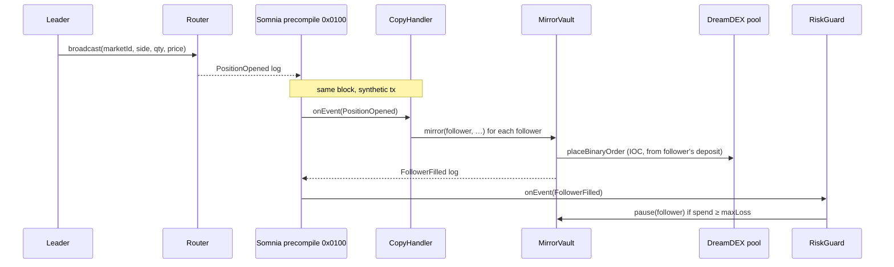

# TapFlow contracts (F3) — same-block copy trading via Somnia reactivity

Four contracts turn a leader's tap into followers' orders **in the same block**,
with no keeper and no off-chain relay, using Somnia's on-chain reactivity
precompile (`0x0100`).

| Contract | Role |
|---|---|
| `Router` | A leader broadcasts a tap → emits `PositionOpened`. |
| `MirrorVault` | Followers deposit tUSDC, name a leader, set ratio + max-loss. Custodial-but-capped: a follower's cumulative spend can never exceed their max-loss. |
| `CopyHandler` | `SomniaEventHandler` subscribed to `Router.PositionOpened`. On each leader tap, validators deliver the event here as a synthetic tx **in the same block**, and it mirrors the tap into every follower's order via `MirrorVault`. |
| `RiskGuard` | `SomniaEventHandler` subscribed to `MirrorVault.FollowerFilled`. Deactivates any follower who has hit their max-loss, so no further signal is mirrored for them. |



## Build & test

```bash
cd contracts
npm install                      # @somnia-chain/reactivity-contracts
forge install foundry-rs/forge-std   # lib/ is not committed
forge test -vv                   # 10 tests, all green (mock pool + mock precompile)
```

Tests cover: broadcast event shape, follower registration, proportional mirroring,
the max-loss spend cap skipping over-budget mirrors, a failed pool order being
skipped (not reverting the whole reactive tx), the RiskGuard pause, withdrawals,
the precompile-only `onEvent` gate, and the 32-STT subscribe floor.

## Deploy + subscribe (needs a funded key)

Each `SomniaExtensions.subscribe` requires the **subscribing contract** to hold
≥ 32 STT at call time, so funding both handlers needs ~64 STT plus gas. Ask the
hackathon faucet topic for enough STT first.

```bash
cd contracts && cp .env.example .env   # set PRIVATE_KEY
# deploy only (no subscriptions):
forge script script/Deploy.s.sol --rpc-url shannon --broadcast -vvv
# deploy + fund CopyHandler (33 STT) + subscribe; add SUB_RISKGUARD=true for both:
FUND_HANDLERS=true forge script script/Deploy.s.sol --rpc-url shannon --broadcast -vvv
```

It prints the subscription ids and writes `deployments.json` (addresses + ids),
which the web app and indexer read. Put `router` into the agent's `ROUTER_ADDRESS`
and the app's `VITE_ROUTER_ADDRESS` to light up the in-block mirror.

## Deployed on Shannon (v4, 8 Sep 2026)

| Contract | Address |
|---|---|
| Router | `0x512009743f48A924F679907ca9E206b706d499Cc` |
| MirrorVault v4 | `0x535A2F473f073AB27FAd8F65ECD5Fe1203C8aE95` — shares + module redeem, bounded price cushion, lot-grid sizing, reason codes |
| CopyHandler v4 | `0x969B4F8c0106379b553232D9aFcf35B77F32b321` — subscription **16910004**, funded 33 STT |
| RiskGuard v4 | `0x03A52EE60b30537fa57C889795576E63CFCaE3b7` — wired, triggered by `FollowerCapped`; subscription pending 32 STT |

v4 makes mirrors fill. The leader's own IOC consumes the book at their limit, so a
follower priced identically gets nothing: `mirror` now bids a cushion (15% of the
leg, at most 5 points, never above 0.97, never below the leader's own price),
floors the quantity to the venue's lot, and returns a reason code that
`CopyHandler` writes into `Mirrored`. Reason codes: 0 filled, 1 not following,
2 size below the lot, 3 max-loss cap, 4 no budget, 5 no liquidity at the price,
6 vault call reverted. Because the vault refuses any order that would cross the
cap, `spent` never reaches `maxLoss`; the refusal emits `FollowerCapped` and
`RiskGuard` subscribes to that instead of `FollowerFilled`.

v3 added settlement for followers: `setVenue(module, operatorId, venueId)` and
`approveOutcomeToken(outcomeToken)` (ERC-6909 `setOperator` for the module) are
called once by the owner; then anyone can call `redeem(follower, marketId,
outcomeIdx, amount)` on a settled window and the payout lands in the follower's
withdrawable deposit. Deploying the v3 vault needs `--gas-limit 60000000`
(it ran out at 20M). v2 (`0x4d5F…`, `0x2Fff…` sub 16764091, `0x8E6F…`) retired.

v1 (`MirrorVault 0xF5fc…`, `CopyHandler 0x63Ed…`, sub 16760441) is retired: it escrowed
`price × qty` for DOWN mirrors instead of `(1 − price) × qty`. Fixed in
`MirrorVault.mirror`, covered by `test_mirror_down_escrows_one_minus_price`.

Same-block mirror proof: block [482312219](https://shannon-explorer.somnia.network/block/482312219).

## What actually works on Somnia (read this before deploying)

`forge script … --broadcast` fails twice over here. First, the script's local run
calls `SomniaExtensions.subscribe`, which does a high-level call to `0x0100`; the
precompile has no bytecode in Foundry's EVM, so Solidity's code-size check
reverts before anything is sent. Second, even deploy-only, Foundry sizes gas
from its local EVM and Somnia prices contract creation about **10×** higher
(Router: 1.95M gas used vs ~0.2M estimated), so every `CREATE` ran out of gas
at the default multiplier and at 4×.

The sequence that works:

```bash
set -a; source ../.env; set +a
forge create src/Router.sol:Router          --rpc-url shannon --private-key $PRIVATE_KEY --broadcast --gas-limit 60000000
forge create src/MirrorVault.sol:MirrorVault --rpc-url shannon --private-key $PRIVATE_KEY --broadcast --gas-limit 60000000 --constructor-args 0x70a86D8842FB63C4Ad2b7cdddF530eBf1BB25d8E
forge create src/CopyHandler.sol:CopyHandler --rpc-url shannon --private-key $PRIVATE_KEY --broadcast --gas-limit 60000000 --constructor-args <vault> <router>
forge create src/RiskGuard.sol:RiskGuard     --rpc-url shannon --private-key $PRIVATE_KEY --broadcast --gas-limit 60000000 --constructor-args <vault>
# wiring, funding and subscribe: let the node estimate gas (it knows Somnia's pricing)
cast send <vault> "setWiring(address,address)" <copyHandler> <riskGuard> --rpc-url shannon --private-key $PRIVATE_KEY
cast send <copyHandler> --value 33ether --rpc-url shannon --private-key $PRIVATE_KEY
cast send <copyHandler> "subscribe(uint64)" 0 --rpc-url shannon --private-key $PRIVATE_KEY
# v3 settlement wiring (module + operatorId + venueId from MarketCreated; outcome token from getBinaryPoolParams)
cast send <vault> "setVenue(address,uint32,bytes32)" 0x3ecC694Cef705358864a646142ac17A90E29e388 2 0x679795a0195a1b76cdebb7c51d74e058aee92919b8c3389af86ef24535e8a28c --rpc-url shannon --private-key $PRIVATE_KEY
cast send <vault> "approveOutcomeToken(address)" 0xB52c5934113Af5c0Bb20eb3C72290C8215f755b9 --rpc-url shannon --private-key $PRIVATE_KEY
cast call <copyHandler> "subscriptionId()(uint256)" --rpc-url shannon
```

Never pass a hand-picked `--gas-limit` to `cast send` on Somnia: `setWiring` needed
451k, a fresh-address STT transfer 421k, `setFollow` 1.28M. The node's
`eth_estimateGas` pads correctly (2–5× over what is finally used).

Unit tests: `forge test -vv` → 10/10 against a mock pool + mock precompile.

Credits: `@somnia-chain/reactivity-contracts` (MIT, Somnia Foundation); binary
pool ABI from the DreamDEX EC template.
