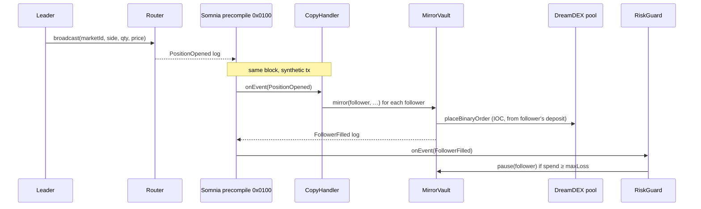

# TapFlow contracts (F3) — same-block copy trading via Somnia reactivity

Four contracts turn a leader's tap into followers' orders **in the same block**,
with no keeper and no off-chain relay, using Somnia's on-chain reactivity
precompile (`0x0100`).

| Contract | Role |
|---|---|
| `Router` | A leader broadcasts a tap → emits `PositionOpened`. |
| `MirrorVault` | Followers deposit tUSDC, name a leader, set ratio + max-loss. Custodial-but-capped: a follower's cumulative spend can never exceed their max-loss. |
| `CopyHandler` | `SomniaEventHandler` subscribed to `Router.PositionOpened`. On each leader tap, validators deliver the event here as a synthetic tx **in the same block**, and it mirrors the tap into every follower's order via `MirrorVault`. |
| `RiskGuard` | `SomniaEventHandler` subscribed to `MirrorVault.FollowerFilled`. Deactivates any follower who has hit their max-loss, so no further signal is mirrored for them. |



## Build & test

```bash
cd contracts
npm install                      # @somnia-chain/reactivity-contracts
forge test -vv                   # 10 tests, all green (mock pool + mock precompile)
```

Tests cover: broadcast event shape, follower registration, proportional mirroring,
the max-loss spend cap skipping over-budget mirrors, a failed pool order being
skipped (not reverting the whole reactive tx), the RiskGuard pause, withdrawals,
the precompile-only `onEvent` gate, and the 32-STT subscribe floor.

## Deploy + subscribe (needs a funded key)

Each `SomniaExtensions.subscribe` requires the **subscribing contract** to hold
≥ 32 STT at call time, so funding both handlers needs ~64 STT plus gas. Ask the
hackathon faucet topic for enough STT first.

```bash
cd contracts && cp .env.example .env   # set PRIVATE_KEY
# deploy only (no subscriptions):
forge script script/Deploy.s.sol --rpc-url shannon --broadcast -vvv
# deploy + fund CopyHandler (33 STT) + subscribe; add SUB_RISKGUARD=true for both:
FUND_HANDLERS=true forge script script/Deploy.s.sol --rpc-url shannon --broadcast -vvv
```

It prints the subscription ids and writes `deployments.json` (addresses + ids),
which the web app and indexer read. Put `router` into the agent's `ROUTER_ADDRESS`
and the app's `VITE_ROUTER_ADDRESS` to light up the in-block mirror.

## Status

Compiles (solc 0.8.30, Cancun, via-IR), unit-tested against mocks. Not yet
deployed to Shannon — that step needs a funded key and ≥ 64 STT for the two
subscriptions. See `SDK-FEEDBACK.md` for the reactivity notes.

Credits: `@somnia-chain/reactivity-contracts` (MIT, Somnia Foundation); binary
pool ABI from the DreamDEX EC template.
